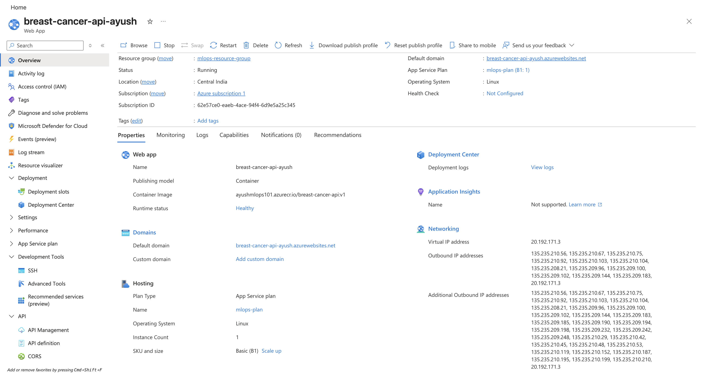
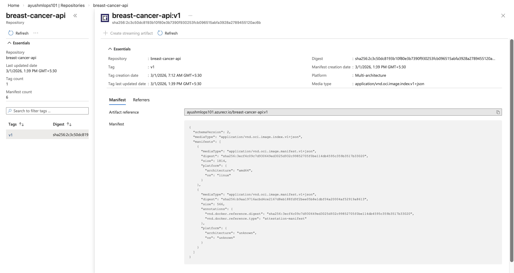

# Azure Deployment — Historical Reference

This document captures the original Azure deployment of the Breast Cancer 
Detection API before migration to GCP Cloud Run.

See [README.md](README.md) for the current GCP deployment and migration 
rationale.

---

## What was running on Azure

**App Service:** `breast-cancer-api-ayush`  
**Plan:** B1 (Basic, 1 vCPU, 1.75GB RAM) — always-on Linux VM  
**Registry:** `ayushmlops101.azurecr.io` (Azure Container Registry)  
**Image:** `ayushmlops101.azurecr.io/breast-cancer-api:v1`  
**Region:** Central India  
**Status at teardown:** Running, Healthy  

The ACR image is preserved at `ayushmlops101.azurecr.io/breast-cancer-api:v1`
and can be redeployed to Azure at any time.

---

## Screenshots

### App Service — running on Azure



### Azure Container Registry — image stored



### Live API — Swagger UI


---

## Azure architecture
```
User (JSON)
    │
    ▼
Azure App Service (Linux, B1 plan)
    │   always-on VM, Central India region
    ▼
Docker Container (pulled from ACR on startup)
    │
    ▼
FastAPI + Pydantic validation
    │
    ▼
StandardScaler + MLPClassifier
    │
    ▼
JSON response
```

**Registry:** Azure Container Registry (`ayushmlops101.azurecr.io`)  
**Build:** `docker buildx build --platform linux/amd64` (cross-compiled 
from Apple Silicon)  
**Port:** 80 (Azure App Service routing requirement)

---

## Why we migrated

Azure App Service runs a VM continuously regardless of traffic. For a 
low-traffic inference API, this means paying for 24 hours of compute 
every day to serve near-zero requests.

GCP Cloud Run scales to zero when idle — no traffic means no cost. The 
Docker image required zero changes. Only the platform changed.

Full migration details in [README.md](README.md).